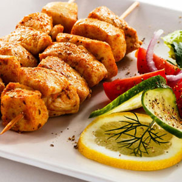

						

							<a href="single.html">
								

									

										
										<h3>Первые блюда</h3>
										
Первые блюда, которые изменят ваше меню.
										

									

								

							</a>
						

						

							<a href="single.html">
								

									

										
										<h3>Вторые блюда</h3>
										
Ситные рецепты для любителей покушать.
										

									

								

							</a>
						

						

							<a href="single.html">
								

									

										
										<h3>Десерты</h3>
										
Эксклюзивные рецепты, сладостей на все вкусы.
										

									

								

							</a>
						

						
 

